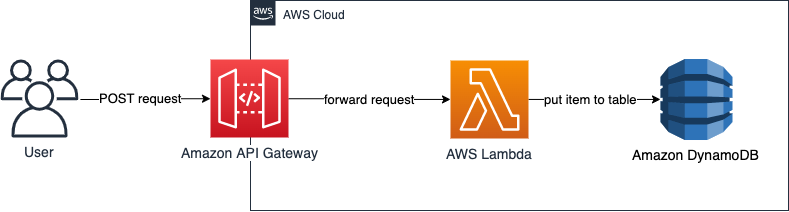

# Leverage L2 constructs to reduce complexity of your CDK application

This repository contains the full source code that is used in the blog post - [Leverage L2 constructs to reduce the complexity of your AWS CDK application](https://aws.amazon.com/blogs/devops/leverage-l2-constructs-to-reduce-the-complexity-of-your-aws-cdk-application)

## Solution overview 

The CDK application uses two stacks:
- CdkBlogLevel1
- CdkBlogLevel2

CdkBlogLevel1 uses L1 constructs while CdkBlogLevel2 uses L2 contructs. See [AWS Construct library](https://docs.aws.amazon.com/cdk/v2/guide/constructs.html#constructs_lib) in CDK documentation for details on the different construct levels.

Both stacks deploy the same sample architecture. This solution uses [Amazon API Gateway](https://aws.amazon.com/api-gateway/), [AWS Lambda](https://aws.amazon.com/lambda/), and [Amazon DynamoDB](https://aws.amazon.com/dynamodb/) to implement a simple serverless web application. The application receives a POST request from a user via API Gateway and forwards it to a Lambda function using proxy integration. The Lambda function writes the request body to a DynamoDB table.

The following image illustrates the architecture:



## Getting started

### Prerequisites
- AWS account
- Node.js v14
- Git

### 1. Complete the prerequisites and clone this repo
```
git clone git@github.com:aws-samples/aws-cdk-l2-constructs.git
```
### 2. Open the repository in your preferred IDE
### 3. Install dependencies
`npm install`
### 4. Ensure AWS credentials are configured
### 5. Deploy your app
```
npx cdk bootstrap
npx cdk synth
npx cdk deploy CdkBlogLevel1
npx cdk deploy CdkBlogLevel2
```
### 6. Try out
Send a post request to the corresponding API Gateway to test both stacks.

```
curl -X POST -H "Content-Type: application/json" \
    -d '{"id": "yourID", "content": "yourContent"}' \
    https://your-api-gateway-url
```
If successful you will receive a HTTP 200 Status Code.
## Cleaning up

When you are done, make sure to clean everything up.

Run the following command to shut down the resources created in this workshop.

```
npx cdk destroy CdkBlogLevel1
npx cdk destroy CdkBlogLevel2
```

## Security

See [CONTRIBUTING](CONTRIBUTING.md#security-issue-notifications) for more information.

## License

This library is licensed under the MIT-0 License. See the LICENSE file.


